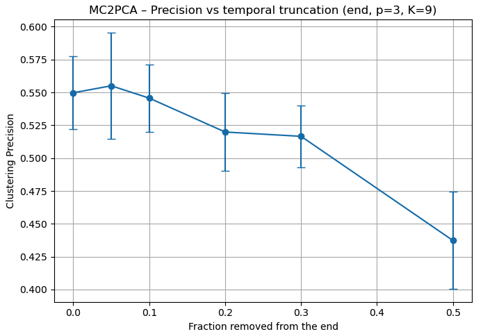
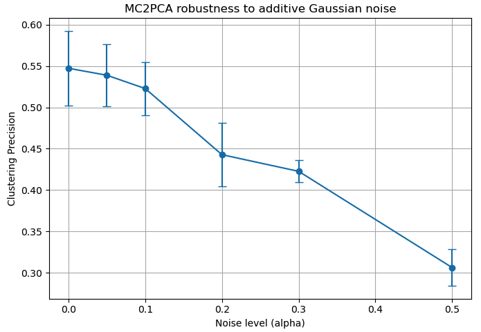
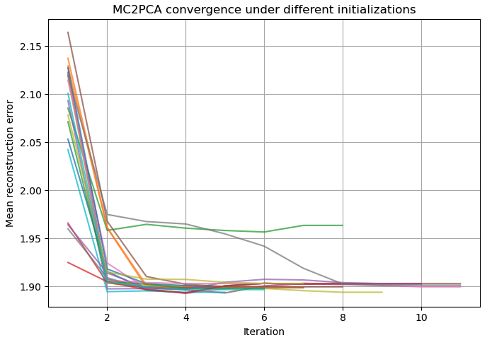
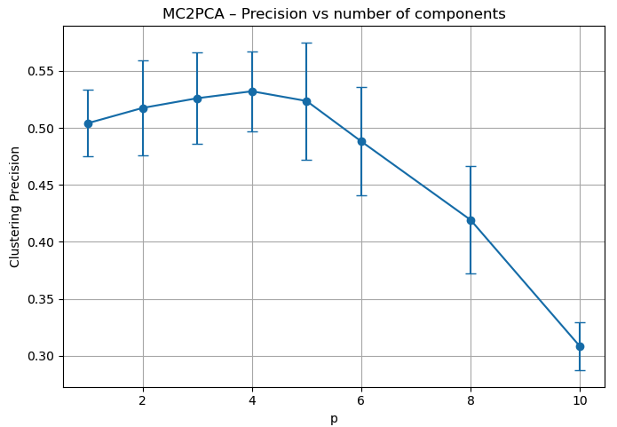

# Implementation-of-the-MC2PCA

This repository contains an implementation of **MC2PCA** algorithm[1] along with evaluation examples on the Japanese Vowels dataset, the Spoken Arabic Digits dataset and the Basic Motion dataset. It contains also experiments on the clustering precision under various p retained values for PCA and also extra-experiments on Basic motion dataset, focusing on missing values, additive noise and convergence of the method. 

The repository is organized as follows:

- `MC2PCA.py` contains implementation of the method.
- `experiments/` folder that contains the experiments.
- `dataset_manager.py` contains data utils.
- `metrics.py` contains metric utils.

## Results
Here are some results, the rest can be found in `experiments` folder.

<section class="results-grid" aria-label="Results figures">
	
	
	
	
</section>

## Development
Install the repository dependencies with `pip install -r requirements.txt`.  

## Datasets
### Japanese Vowels
Kudo, M., Toyama, J., & Shimbo, M. (1999). Japanese Vowels [Dataset]. UCI Machine Learning Repository. https://doi.org/10.24432/C5NS47.  
Available with `sktime.datasets.load_japanese_vowels`.

## Spoken Arabic Digits
Bedda, M. & Hammami, N. (2008). Spoken Arabic Digit [Dataset]. UCI Machine Learning Repository. https://doi.org/10.24432/C52C9Q.  
Available at this [link](https://archive.ics.uci.edu/dataset/195/spoken+arabic+digit).

## Basic motions
Jack Clements, UEA, [Basic Motions](https://www.timeseriesclassification.com/description.php?Dataset=BasicMotions). Available with `sktime.load_basic_motions`. 

## References
[1] Hailin Li, Multivariate time series clustering based on common principal component analysis, Neurocomputing, Volume 349, 2019, Pages 239-247, ISSN 0925-2312, https://doi.org/10.1016/j.neucom.2019.03.060.
